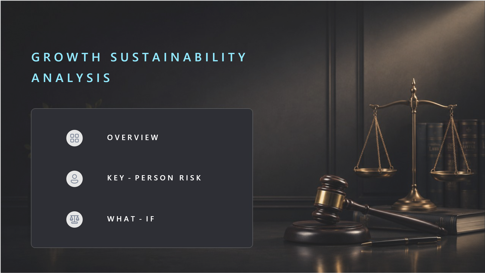
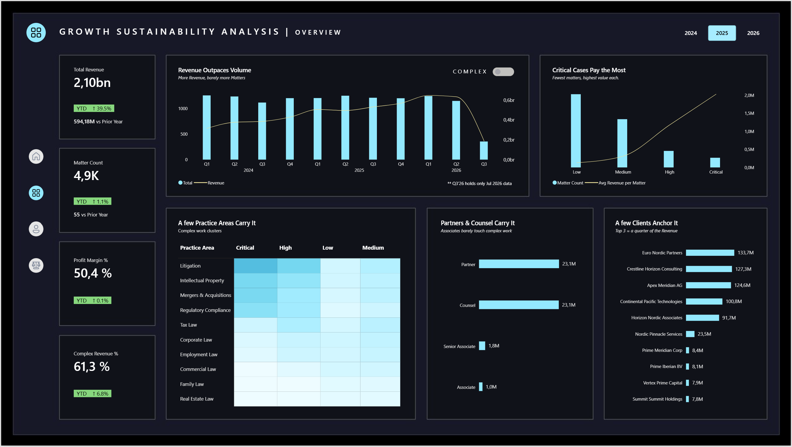

# Growth Sustainability Analysis

Built an end-to-end Power BI analytics solution, covering data cleaning and transformation in Power Query, dimensional modelling, a star-schema semantic model with time intelligence and an interactive what-if simulation, and a three-page interactive report. It answers one board-level question for a fast-growing law firm: is the revenue growth sustainable, or does it depend on a handful of people who could leave?

## What this is about

Over 2024 to 2026 the firm grew fast. Quarterly revenue run-rate roughly doubled and like-for-like revenue is up year on year. On the surface the firm looks healthy: still growing, profit margin steady at around 50%.

Underneath, the growth is concentrated. Complex work (High and Critical matters) drives about 65% of revenue on under a fifth of the caseload. That complex work clusters in a few practice areas and is carried almost entirely by Partners and Counsel: about 15 senior lawyers generate around 58% of all complex revenue. A few clients anchor the book.

Then five senior lawyers left in three quarters, including the firm's top three complex-revenue generators. The headline numbers barely moved, but the complex book those people carried shifted onto the remaining seniors, pushing complex workload per senior above the level the firm carried when fully staffed. The surface looks stable. Underneath, the channel of the business that pays the most now rests on fewer people, and the firm is one or two more departures from a capacity problem.

**The report tells this story across three pages:**

**Page 1:** Here is what is happening. Revenue is up, matters are not. The gap between revenue and volume is the story: growth is coming from fewer, more complex, higher-value matters.
**Page 2:** Here is who carries it, and who left. Click through all 15 senior lawyers, see the rainmakers on the curve, and the five departures with what walked out with them.
**Page 3:** Here is what to do next. Use the sliders to model promoting from within versus hiring laterally, and watch complex workload per senior drop back under the healthy line.

## Screenshots

**Home Page**

**Page 1: Overview**

**Page 2: Comparison View**

**Page 3: What-If Analysis**

## Architecture

Its a Power BI stand-alone project. The dataset is a Excel Workbook with Fact and Dimension tables. The data cleaning is performed in Power Query. The flow is import and model.

## The Layers

### Cleaning and transformation (Power Query)

The source is mildly messy and gets standardised into clean fact and dimension tables:

- Whitespace trimmed, nulls handled, data types set explicitly.
- Text standardised to consistent casing (each word capitalised), so repeated free-text values collapse to a single member instead of splitting into near-duplicates.
- Columns renamed to model-friendly names.
- Supporting fields prepared for the model, for example a formatted departure field used by the profile status pill.

### The star schema

One fact, five dimensions, single-direction one-to-many throughout.

Fact: Fact_Cases, one row per matter, carrying revenue, profit, billable hours and the lawyer, client, office, case and date keys.

Dimensions: Dim_Case, Dim_Lawyer, Dim_Client, Dim_Office, Dim_Date.

### Semantic model

A clean star schema. Every dimension connects to Fact_Cases on its key through a single-direction one-to-many relationship.

One relationship worth noting: Dim_Date is role-playing. It connects to Fact_Cases on the matter open date as the active relationship, and on the close date as an inactive relationship (available through USERELATIONSHIP where close-date analysis is needed). This avoids relationship ambiguity while keeping both the open and close perspectives available from one date table.

Dim_Date also carries an Is YTD Jul26 flag that marks the year-to-date window, which the time-intelligence measures use so partial-year comparisons stay honest (more on this below).

## The Report Structure

### Page 1: Overview

The headline page. Four KPI cards, Total Revenue, Matter Count, Profit Margin % and Complex Revenue %, each show the current value and its year-to-date change against the prior year, with a coloured pill and a direction arrow. A year selector (2024, 2025, 2026) drives everything on the page.

The centrepiece is "Revenue Outpaces Volume": revenue and matter count plotted together on a quarterly axis, with a Total/Complex toggle. The gap tells the story: revenue climbs while volume stays flat, so growth is coming from fewer, more complex matters. The chart title and subtitle are dynamic and change with the toggle so the label always matches the series on show.

The rest of the page proves the concentration: revenue per matter by complexity (Critical pays the most), a complexity by practice-area heatmap (Litigation carries it), average complex revenue per lawyer by seniority (Partners and Counsel carry it, Associates barely touch complex work), and revenue by client (a few clients anchor the book).

### Page 2: Key-Person Risk (Career-to-Date View)

The attribution page, scoped career-to-date because departures and revenue books are multi-year facts rather than a single-year snapshot.

"Complexity Climbs with Rank" shows complex work sitting with the senior ranks. "A Handful of Rainmakers" is a custom scatter of complex revenue against complex matters per lawyer, colour-coded Rainmaker, Other and Departed, and the departed lawyers sit high on the curve. "Who Left, and What Walked With Them" lists the five senior exits with their key client, revenue, reason and date. The "Senior Personnel Profile" card lets you click through all 15 senior lawyers, with departed lawyers flagged by a red status pill built as an SVG measure.

### Page 3: What-if Analysis

The forward-looking page. Workload health is measured as complex matters per senior lawyer, against a healthy line set to the firm's complex load per senior when it was fully staffed, before the departures.

Two bullet bars sit against that shared line. "Do Nothing" is a static baseline sitting over the line. "Your Plan" moves with two sliders, Promote (elevate proven senior associates) and Hire (lateral senior hires), and as they move the lower bar drops and crosses back under the healthy line. A cost-versus-benefit ledger shows annual hire cost and headcount added against restored workload status and the annual complex-revenue capacity protected, and a "Who You'd Promote" panel shows the win rates of the internal candidates. A dynamic verdict sentence restates the outcome in words. For example, a small mix such as promote 4 and hire 2 pulls complex workload from 52 back under the healthy line to 46, for around 700K per year while protecting roughly 135M per year in complex-revenue capacity. Everything is framed as illustrative planning, not prediction.

## Technical decisions worth calling out

**Dynamic titles and subtitles.** The trend chart's title and subtitle are measures, not typed text, and switch with the Total/Complex toggle through a field parameter and a SWITCH. The chart can never mislabel whichever series is showing.

**YTD on a partial year.** 2026 holds data only through July. Comparing a partial 2026 against a full 2025 would misread growth as decline, so every KPI delta is computed year-to-date against the same span last year, driven by the Is YTD Jul26 flag and labelled "YTD" on the card. The comparison stays like-for-like no matter which year is selected.

**No prior year, no delta.** In the first year (2024) there is no prior year to compare against. Every year-over-year measure guards on ISBLANK of the prior-year value and returns BLANK(), so the 2024 cards show the current value with no misleading zero movement, and the coloured pill simply does not render.

**SVG status pill.** The employment-status pill on the profile card is drawn as an inline SVG measure, so its fill and text colour react to the lawyer's status (red for departed, otherwise the brand colour) without adding a custom visual.

**Role-playing date.** Dim_Date joins the fact on open date (active) and close date (inactive), so open-date reporting is the default while close-date analysis stays available through USERELATIONSHIP, with no second date table.

**The what-if is anchored to a real baseline.** The healthy line is not a guessed target. It is the firm's actual complex load per senior before the departures, the workload it has already proven it can carry. The simulation adds seniors (promotions ramp to full output over time, hires land immediately) and recomputes complex-per-senior live.

**Revenue capacity is annual, to match the annual cost.** The protected-capacity figure is built on complex revenue per senior for a full year, so it compares like-for-like against the annual hire cost. An earlier lifetime-based version overstated the benefit against a per-year cost. Putting both on a yearly basis keeps the cost-and-benefit comparison honest.

**Two bars, not a gauge.** Workload health is shown as a baseline bar and a simulated bar against a shared reference line, rather than a single gauge, so the problem (over the line) and the fix (under the line) are visible at the same time.

## Skills demonstrated

Power BI Desktop, Power Query (M) data cleaning and transformation, dimensional modelling (star schema, role-playing date with active and inactive relationships, single-direction filtering), DAX (time intelligence, year-to-date with partial-year handling, prior-year blanking, what-if parameters, dynamic titles and subtitles, SVG measures, percentage-point deltas, a live capacity simulation), and Power BI report design with interactivity that serves the story.

## Data and disclaimer

The dataset is synthetic, generated for portfolio purposes. All lawyer names, client names, revenue figures, departures and win rates are fictional and do not represent any real firm, person or client.
